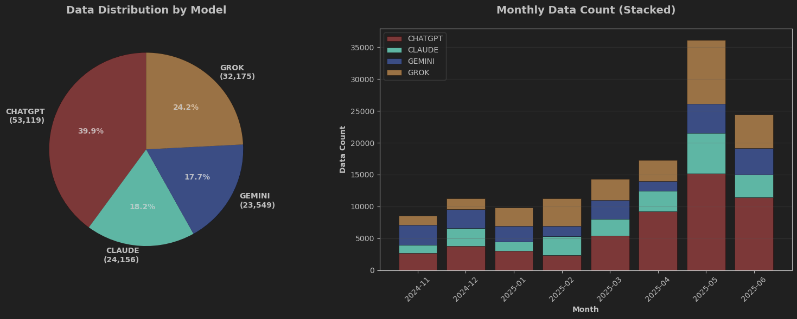
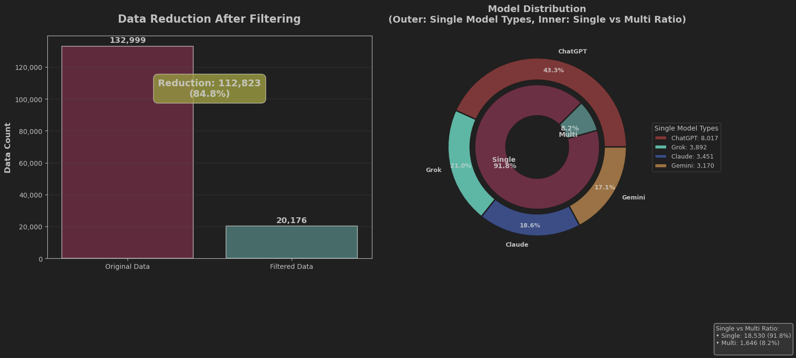
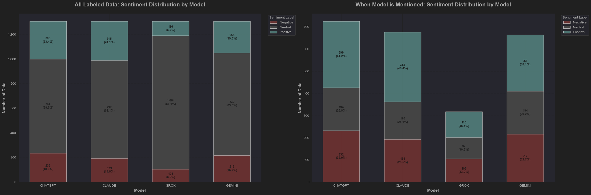
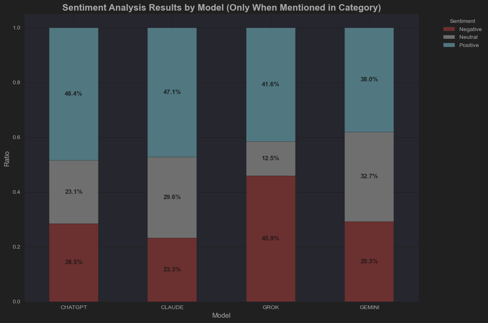
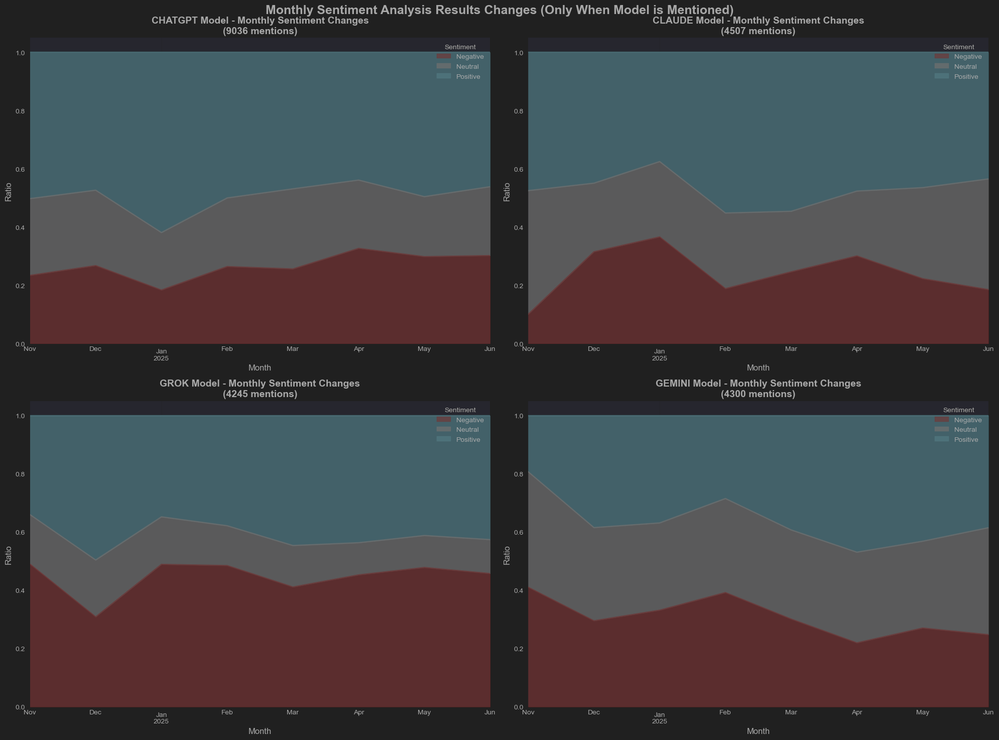
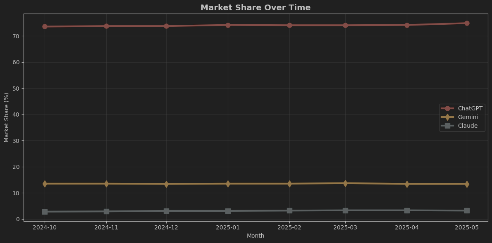
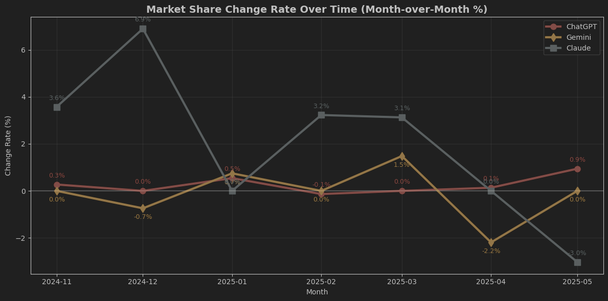
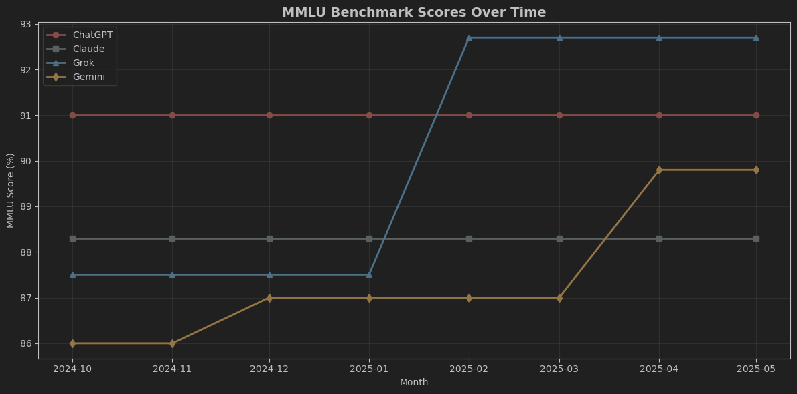

## 1.프로젝트 개요
    ** 연구 목표:급변하는 대규모 언어 모델(LLM) 시장에서 세 가지 핵심 요소 간의 동적 상관관계를 규명한다 또한,주요 이벤트와 요소간의 관계도 분석한다. **

- **소셜 미디어 상의 대중적 여론**
- **객관적인 벤치마크 성능**  
- **실질적인 시장 점유율**
- **주요 이벤트(Key Events)**

### 주요 연구 질문

#### 1. SNS 여론 → 시장 점유율
특정 AI 모델에 대한 긍정적/부정적 여론 변화가 해당 모델의 시장 점유율 변화로 이어지는가?

#### 2. 벤치마크 성능 → 시장 점유율  
새로운 모델 출시에 따른 벤치마크 성능 우위가 실제 사용자들의 선택에 유의미한 영향을 미치는가?

#### 3. 벤치마크 성능 → SNS 여론
AI 모델의 벤치마크 성능 지표가 사용자들의 인식 및 SNS 상의 긍부정 반응에 직접적인 영향을 주는가?

#### 4. 주요 이벤트 → 여론/점유율
신규 기능 출시, 요금제 변경 등 주요 이벤트가 SNS 여론과 시장 점유율에 통계적으로 유의미한 변화를 촉발하는가?

### 기술적 접근법

**타겟 기반 감성 분석(Target-Based Sentiment Analysis)** 과업을 해결하기 위해 다음과 같은 아키텍처를 제안합니다:

- **멀티태스크 및 멀티레이블 분류** 아키텍처를 적용한 MobileBERT 모델
- 시계열 감성 데이터와 외부 시장/성능 데이터의 결합 분석
- LLM 시장의 성공 요인에 대한 다각적 분석 및 실증적 인사이트 제공

---

*본 프로젝트는 AI 모델 시장의 복잡한 생태계를 이해하고, 데이터 기반의 전략적 인사이트를 도출하는 것을 목표로 한다.*

## 2.데이터 수집
### 2-1. 데이터 출처 및 선정 이유 
* 데이터 출처 : Reddit
* 선정 이유
   * 데이터 접근성
     * 다수의 소셜 미디어 플랫폼(트위터(X), 인스타그램)의 폐쇄적인 정책으로 인해 데이터 수집(크롤링)이 매우 제한적이다.
     * Reddit은 공식 API(Application Programming Interface)를 제공하여 데이터에 비교적 쉽고 합법적이고 안정적으로 접근할 수 있다.
   * 언어
     * MobileBERT 모델 학습을 위해서는 대규모의 영어 텍스트 데이터가 필요하다. Reddit은 영어권 사용자가 대다수를 차지하는 대표적인 커뮤니티로 영어 데이터를 확보하기에 최적의 환경이다.

### 2-2. 데이터 수집 대상 및 결과
  * 내용 : 상용 LLM 의 대표 모델(chatgpt, claude, grok, gemini)이 언급된 게시물의 제목,본문,댓글을 수집 대상으로 설정하였다.
  * 기간 : 2024년 11월 1일부터 2025년 6월 18일까지 약 8개월 동안 생성된 게시물로 한정하였다.
  * 결과 : 전체: 132,999개 개의 데이터를 확보했고, csv 형태로 저장된다.

### 2-3. 데이터 수집 방법
   * 수집 도구: reddit 공식 크롤링 api
     * 작동 방식 및 한계점: reddit 공식 api는 해당 키워드의 관련성 또는 최신순으로 조회한후 조회된 데이터에서 날짜를 기준으로 필터링한 데이터를 가져온다. 따라서 조회 데이터를 크게 늘려서 수집해도 예전 데이터 수는 적고 최근 데이터 수가 많이 수집된다. 
     * 주의 사항: 레딧 API는 단시간 내 대량의 데이터를 요청할경우 매우 높은 확률로 API 접근을 제한 당한다. 안정적인 데이터 확보를 위해서 점진적이고 주기적으로 수집하였으나, 신중한 접근에도 불구하고 4차례의 API 접근 제한을 당해 API 재발급을 받았다.
   * 수집 방법
     * 수집 세분화: 각 모델(chatgpt, claude, grok, gemini)별로 월(8개월)별로 총 32(4개 모델 x 8개월)번 이상 수집하였다.
     * 수집 절차: 한 번의 요청 당 게시글을 약 150개씩 조회 하였고,날짜에 맞게 최대 25개씩 수집 했으며, 해당 게시물에 달린 댓글은 모두 수집하는 방식을 사용하였다.

```
# 데이터 수집 핵심 코드
SEARCH_QUERY = 'chatgpt'  #검색할 키워드
SUBREDDIT_TO_SEARCH = 'all' #서브레딧
LIMIT_POSTS = 25  #최대로 가져올 게시글 수
CSV_FILENAME = '../raw_data/new_data/2025_6_chatgpt.csv' # 파일 명 
CSV_HEADER = ['Post_ID', 'Type', 'Data', 'Timestamp']
START_DATE = datetime.datetime(2025, 6, 1, 0, 0, 0, tzinfo=datetime.timezone.utc).timestamp() # 날짜 범위 설정 (UTC 기준)
END_DATE = datetime.datetime(2025, 6, 18, 23, 59, 59, tzinfo=datetime.timezone.utc).timestamp() 
```

### 2-4.수집된 데이터 예시 및 시각화
| Post_ID   | Type           | Data                                                                                                                               | Timestamp           |
|:----------|:---------------|:-----------------------------------------------------------------------------------------------------------------------------------|:--------------------|
| 게시글 고유 ID | 0-제목 1-본문 2-댓글 | 데이터                                                                                                                                | 게시한 시간              |
| 1gvv0sr   | 0              | Chinese o1 competitor (DeepSeek-R1-Lite-Preview) thinks for over 6 minutes! (Even GPT4o and Claude 3.5 Sonnet couldn't solve this) | 2024-11-21 02:32:18 |
| 1gvv0sr   | 2              | o1 mini only thought for 26 seconds. banged out the correct answer                                                                 | 2024-11-21 03:43:59 |



---
## 3. 데이터 검증 및 전처리
### 3-1. 데이터 검증
* 게시물의 제목을 전부 읽어서 ai와 관련 없는 데이터를 데이터 프레임에서 제외시켰다.
* 제목만 보고 ai 관련 게시글인지 알 수 없는 경우에는 직접 게시글을 reddit 에서 확인 하였다.
* 예시: gemini - 별자리 ,claude - 사람 이름 등

### 3-2. 데이터 전처리
1. 중복 데이터 제거
2. 데이터 정제 
   1. 데이터의 값들을 소문자로 변환
   2. ['chat-gpt', 'chat_gpt', 'chat gpt'] 를 'chatgpt'로 변환
      * 데이터 필터링 과정에서 데이터를 더 많이 확보하고 싶다면 o1 o3 를 chatgpt o1, sonnet 을 claude sonnet 등으로 변환 가능하나, 최소한의 데이터 변형을 위해 본 프로젝트에서는 진행하지 않았다.
3. 데이터 필터링
    * ['chatgpt', 'claude', 'grok', 'gemini'] 중 하나라도 포함된 데이터로 필터링
4. 데이터 카테고리화 
5. 균일한 라벨링 위한 데이터 샘플 순서 무작위화,카테고리별 정렬

### 3-3 데이터 전처리 후 변화 시각화
* single : ('chatgpt', 'claude', 'grok', 'gemini') 중 한개만 언급된 데이터
* multi : ('chatgpt', 'claude', 'grok', 'gemini') 중 2개 이상 언급된 데이터



---
## 4. 데이터 라벨링
### 4-1. 라벨링 개요

* 라벨링 목적 : 감성 분석
* 라벨링 데이터 : 영문 기반 텍스트 데이터
* 라벨링 형태 : [0,0,0,0]
  * 각 차원은 주어진 카테고리 ('chatgpt', 'claude', 'grok', 'gemini')에 해당
  * 0은 중립 또는 관련 없음, 1은 긍정, -1은 부정으로 라벨링
* 라벨링 갯수
  * 총 라벨: 1305개
  * 멀티 라벨: 데이터 905 개
  * 싱글 라벨: 400 개 (모델별 100개) 

| 텍스트 데이터 | ChatGPT | Claude | Grok | Gemini | **최종 라벨** |
| :--- | :---: | :---: | :---: | :---: | :---: |
| "Claude는 글쓰기를 정말 잘해주는데, Gemini는 지시를 자꾸 무시해서 별로야." | 0 | 1 | 0 | -1 | `[0, 1, 0, -1]` |
| "ChatGPT랑 Gemini 둘 다 이상한 계산법을 알려주네." | -1 | 0 | 0 | -1 | `[-1, 0, 0, -1]` |
| "Grok이 드디어 한국에 출시되었다니 너무 기대된다!" | 0 | 0 | 1 | 0 | `[0, 0, 1, 0]` |
| "오늘 점심 메뉴는 뭐 먹지?" | 0 | 0 | 0 | 0 | `[0, 0, 0, 0]` |

### 4-2 라벨링 규칙

1. '단순 사용' 언급은 '중립(0)'을 기본으로 한다.
   * 어떤 모델을 단순히 '사용한다', '접근한다', '목록에 있다' 또는 특정 작업 흐름의 일부로 언급되는 것만으로는 해당 모델 자체의 품질이나 성능에 대한 명시적인 긍정 또는 부정 평가가 없는 한 중립(0)으로 판단한다.
   * 예시: '저는 챗GPT, 제미니, 클로드를 번갈아 사용했습니다.' → 이 문장 자체만으로는 각 모델에 대한 평가는 중립(0).
2. 평가의 결과물에 감정 표현이 있으면 그 감정에 따라 라벨한다.
   * 모델의 품질, 성능, 특정 기능에 대한 직접적이고 명시적인 긍정/부정 형용사나 서술이 있을 때 가장 확실하게 감정을 판단한다.
3. 문맥 및 암시도 고려한다.
   * 명시적인 단어가 없더라도, 문맥상 특정 모델의 우수성이나 문제점을 강력하게 암시하는 경우 이를 감정 라벨에 반영한다.
4. 기능/제한점에 대한 평가는 사용자 경험과 연결하여 판단한다.
   * 모델의 특정 기능(예: '프롬프트 제한 없음', '온도 조절 가능')이 언급될 때, 이것이 사용자에게 명백한 이점으로 작용하여 선호도의 이유가 된다면 긍정(1)으로 본다.
   * 반대로, '지나친 가드레일', '검열 문제' 등 사용자의 작업을 방해하거나 부정적인 경험을 유발하는 제한점은 부정(-1)으로 판단한다.
5. 비교를 통한 상대적 평가는 감정에 반영한다.
   * 예: '제미니를 챗GPT보다 더 많이 사용한다. 제미니는 프롬프트 제한이 없기 때문이다.' → 제미니는 긍정(1), 챗GPT는 상대적으로 부정(-1))
6. 모호한 지칭어는 '중립(0)'으로 처리한다. 
   * **'그것(that)'** 과 같은 지칭어가 가리키는 대상이 모호하거나 알 수 없으면 중립(0)으로 처리하여 추론의 위험을 줄였다.
7. 복합적 평가:
    * 부정적인 경우와 긍정적인 경우가 비슷한 빈도,강도로 언급된다면, 중립으로 처리한다.빈도수나 강도 전체적인 뉘앙스를 봤을때 긍부정이 어느 한쪽으로 치우친다면 치우친 방향으로 처리한다.
8. 모델 언급 안됨:
    * google Is better 이런식으로 회사명으로 비교되어있다면 중립으로 판단한다.
9. 애매모호하거나 복합적 평가, 모델 언급 안됨,잘 모르겠는 경우는 comment를 적어서 표시한다.

### 4-3 라벨링 한계점 및 개선방향
* 한계점 
  * 초기에 라벨링을 하며 규칙을 만들었으므로 초기에 라벨링 한 데이터는 신뢰도가 떨어질 수 있다.
  * 멀티라벨과 단일라벨의 수가 900:400 으로 균형이 맞지 않는다.
  * 라벨링 갯수가 1300개로 부족하다.
  * 혼자서 라벨링 했기 때문에 주관적이다
* 개선방향
  * 단일라벨의 갯수를 900개 까지 만들면 데이터 불균형과 라벨링 갯수 부족을 어느정도 해결 할 수 있다.
  * 초기에 라벨링한 데이터를 다시 보고 기준에 맞게 재 라벨링 한다.

### 4-4 모델별 라벨링 긍정 중립 부정 비율 시각화

 

---
## 5. 모델 

### 5-1 모델의 과업 : "4개 AI에 대한 타겟별 감성 분석"
* 단순한 감성 분석을 넘어서 개체 간 관계와 비교 표현을 이해해야 한다.
* 일반 MobileBERT는 출력 구조의 한계로 인해서 과업을 수행 할 수 없다.따라서 두가지 커스텀 아키텍처를 사용하였다.
 
### 5-1 첫번째 방법 : 멀티태스크 분류(Multi-task Classification)
* 다중 타겟 감성 분석을 위한 커스텀 분류 헤드가 추가된 파인튜닝된 MobileBERT
* MobileBERT로 텍스트를 이해한 후, 마지막에 4개의 서로 다른 분류기로 각각 ChatGPT/Claude/Grok/Gemini의 감정을 예측하는 방식이다.
* 핵심: "하나의 공유 인코더 + 네 독립 분류기

```
#예시

데이터: i hate chatgpt so much for coding.it's extremly bad compared to claude.
출력: 4차원 벡터

        [-1, 0, 2, 0]
         │  │  │  │
         │  │  │  └─ Gemini: 0 (중립/언급없음)
         │  │  └──── Grok: 0 (중립/언급없음)
         │  └─────── Claude: 1 (중립/언급없음)
         └────────── ChatGPT: -1 (긍정)
```


### 5-2 두번째 방법 : 멀티레이블 분류(Multi-label Classification)
* 멀티레이블 감성 분석을 위한 커스텀 분류 헤드가 추가된 파인튜닝된 MobileBERT
* 멀티레이블 분류: MobileBERT로 텍스트를 이해한 후, 하나의 분류기로 12개 레이블(4개 AI × 3개 감정)을 동시에 예측하되, 제약조건을 통해 각 AI당 하나의 감정만 선택되도록 하는 방식
* 핵심: "하나의 공유 인코더 + 하나의 12차원 분류기 "
* 각 차원은 0,1 의 이진 분류 
* 각 AI별로 하나의 감성만 선택되도록 제약을 추가하여 멀티레이블 분류의 특성상 하나의 AI에 대해 긍정/중립/부정이 동시에 활성화될 수 있는 문제를 방지

```
#예시
데이터: i hate chatgpt so much for coding.it's extremly bad compared to claude.
출력: 12차원 벡터

       [1,0,0,  0,0,1,  0,1,0,  0,1,0]
       ├─────┤ ├─────┤ ├─────┤ ├─────┤
       ChatGPT  Claude   Grok   Gemini
       (부정)     (긍정)   (중립)   (중립)
```

| 구분 | 일반 MobileBERT | 멀티태스크 분류 | 멀티레이블 분류 |
|------|----------------|----------------|----------------|
| **분류 유형** | 이진 분류 (긍정/부정) | 멀티태스크 분류 | 멀티레이블 분류 |
| **출력 크기** | 2개 | 4개 | 12개 (4×3) |
| **출력 형태** | 하나의 클래스 선택 | 각 태스크당 0, 1, 2 중 하나 | 각 위치에 0 또는 1 |
| **아키텍처** | 기본 MobileBert + Linear | 4개 독립 분류기 → 각각 3차원 | 단일 분류기 → 12차원 출력 |
| **손실 함수** | CrossEntropyLoss | CrossEntropyLoss (×4) | ConstrainedBCELoss |
| **평가 지표** | Accuracy | Accuracy, F1, EMR | Accuracy, F1, EMR, Hamming Loss |

### 5-3. 학습 결과


* **결론: 전반적으로 70-80%대 모델별 정확도와 엄격한 평가지표인 EMR(Exact Match Ratio) 40%를 달성하였으며, 멀티태스크 학습된 모델로 전체 라벨링한 데이터 분포를 고려할 때 감정 분석 모델의 학습이 원활히 진행되었다고 볼 수 있다.**

<details>
<summary>전체 성능 비교</summary>

| 지표                 | 멀티헤드   | 멀티라벨       | 비교      |
|----------------------|--------|----------------|---------|
| Average Accuracy     | 77.81% | 77.81%         | 동일      |
| Exact Match Ratio    | 40.82% | 38.78%         | +2.04%  |
| F1 Score (Macro)     | 0.6780 | 0.6591         | +0.0189 |
| Hamming Loss         | -      | 0.1480         | -       |

- **분석**:
  - **train: 0.85 / test:0.15**
  - **Exact Match Ratio**: 멀티헤드 모델이 40.82%로 멀티라벨(38.78%)보다 약 2% 더 높은 성능을 보임. 이는 멀티헤드 모델이 모든 레이블을 정확히 예측한 비율이 더 높음을 의미한다.
  - **F1 Score (Macro)**: 멀티헤드 모델이 0.6780으로 멀티라벨(0.6591)보다 약간 개선됨. 이는 클래스 간 균형 성능이 더 나아졌음을 시사한다.

</details>

<details>
<summary>모델별 성능 비교</summary>

| AI       | 멀티헤드 Accuracy | 멀티라벨 Accuracy | 멀티헤드 F1 | 멀티라벨 F1 | 비교 (F1 기준) |
|----------|-------------------|-------------------|-------------|-------------|----------|
| ChatGPT  | 71.94%            | 68.37%            | 0.6514      | 0.6084      | +0.0430  |
| Claude   | 73.98%            | 76.02%            | 0.6437      | 0.6349      | +0.0088  |
| Grok     | 88.78%            | 88.78%            | 0.7345      | 0.6909      | +0.0436  |
| Gemini   | 76.53%            | 78.06%            | 0.6824      | 0.7021      | -0.0197  |

- **분석**:
  - **ChatGPT**: 멀티헤드 모델에서 Accuracy와 F1 모두 개선(Accuracy: +3.57%, F1: +0.0430). 특히 Neutral 클래스의 F1이 0.8462 → 0.856으로 소폭 상승했다.
  - **Claude**: Accuracy는 멀티라벨이 약간 높지만(76.02% vs 73.98%), F1은 멀티헤드가 소폭 개선(+0.0088). Neutral 클래스의 F1이 0.9016 → 0.874로 약간 하락했으나, Negative와 Positive에서 개선됐다.
  - **Grok**: Accuracy는 동일(88.78%)이나, F1은 멀티헤드가 0.7345로 개선(+0.0436). 특히 Negative와 Positive 클래스의 F1이 상승(예: Negative 0.6531 → 0.643, Positive 0.4516 → 0.600).
  - **Gemini**: Accuracy는 멀티라벨이 약간 높고(78.06% vs 76.53%), F1도 멀티라벨이 약간 우세(0.7021 vs 0.6824). Positive 클래스의 F1이 0.5507 → 0.493으로 하락했다.
  - **최고/최저 성능**:
    - 멀티라벨: Gemini가 최고 F1(0.7021), ChatGPT가 최저(0.6084).
    - 멀티헤드: Grok이 최고 F1(0.7345), Claude가 최저(0.6437)

</details>

<details>
<summary>모델,감정별 F1 스코어 비교</summary>

| 감정             | 멀티태스크 F1 | 멀티라벨 F1 | 비교       |
|------------------|----------|-------------|----------|
| ChatGPT_neg      | 0.4790   | 0.4384      | +0.0406  |
| ChatGPT_neu      | 0.8560   | 0.8462      | +0.0098  |
| ChatGPT_pos      | 0.6190   | 0.5405      | +0.0785  |
| Claude_neg       | 0.4440   | 0.4074      | +0.0366  |
| Claude_neu       | 0.8740   | 0.9016      |  -0.0276 |
| Claude_pos       | 0.6120   | 0.5957      | +0.0163  |
| Grok_neg         | 0.6430   | 0.6531      |  -0.0101 |
| Grok_neu         | 0.9610   | 0.9679      |  -0.0069 |
| Grok_pos         | 0.6000   | 0.4516      | +0.1484  |
| Gemini_neg       | 0.6740   | 0.6750      |  -0.0010 |
| Gemini_neu       | 0.8800   | 0.8807      |  -0.0007 |
| Gemini_pos       | 0.4930   | 0.5507      |  -0.0577 |

- **분석**
  - 멀티헤드가 12개 감정 중 7개(ChatGPT_neg, ChatGPT_neu, ChatGPT_pos, Claude_neg, Claude_pos, Grok_pos, Gemini_neg)에서 더 높은 F1 스코어를 기록하며, 특히 긍정 감정에서 큰 개선(예: Grok_pos +0.1484)을 보인다.
  - 멀티라벨은 5개(Claude_neu, Grok_neg, Grok_neu, Gemini_neu, Gemini_pos)에서 우세하며, 주로 중립과 부정 감정에서 소폭 우세하다.(예: Claude_neu +0.0276).
  - 전반적으로 멀티헤드가 긍정 감정 예측에서 강점을 보이고, 멀티라벨은 중립과 부정 감정에서 약간 더 나은 경우가 많다.

</details>

 ### 5-4. 학습된 모델(멀티 태스크)로 전체 라벨링한 데이터의 분포 

<div style="display: flex;">
   
  
</div>


## 6. 분석 및 시각화

### 6-1 시장 점유율 데이터 (grok은 추가적으로 찾아야함)

<div style="display: flex;">
  
  
</div>


* monthly sentiment analysis result changes 그래프를 보면 시장 점유율 데이터와 어느정도 관련 있는걸 알 수 있다.

### 6-2 벤치마크 데이터 (MMLU)


---

## 7. 결론

* 본 프로젝트는 급변하는 LLM 시장의 동향을 다각적으로 분석하고자 SNS 여론, 벤치마크 성능, 그리고 시장 점유율 간의 복합적인 상관관계를 규명하는 것을 목표로 하였다. 이를 위해 소셜 미디어 데이터를 수집하고 MobileBERT 기반의 감성 분석 모델을 성공적으로 구축하여 대중의 인식을 정량화했다.
* 특히, Multi-Head Classifier 모델과 Multi-label classifier 을 활용하여 각 LLM(ChatGPT, Gemini 등)에 대한 긍정, 부정, 중립 감성을 개별적으로 예측함으로써, 단순 긍/부정 분류보다 훨씬 더 세밀하고 정확한 여론 분석을 수행할 수 있었다.
* 분석 결과, 특정 LLM에 대한 SNS 상의 긍정적 또는 부정적 여론은 해당 모델의 시장 점유율,벤치마크와와 유의미한 관계를 보이는 것을 그래프 상에서 확인했다.
* 결론적으로, 본 연구는 MobileBERT와 같은 경량화된 모델을 통해서도 충분히 유의미한 소셜 데이터 분석이 가능함을 보여주었다.

---
## 8. 한계점 및 개선방향

### 8-1. **한계점**

1.  **데이터의 한계**
    * **플랫폼 편향성**: 데이터 수집을 주로 Reddit에 의존하여, X(구 트위터), Facebook 등 다른 주요 소셜 미디어 사용자들의 다양한 의견을 온전히 반영하지 못했습니다.
    * **기간 및 양적 한계**: 특정 기간에 집중된 데이터는 장기적인 트렌드 변화나 주요 이벤트의 지속적인 파급 효과를 분석하기에 부족하며, 전체 데이터의 양 또한 제한적이었습니다.
    * **라벨링 데이터의 부족 및 편향**: 파인튜닝에 사용된 1,300개의 자체 라벨링 데이터는 모델이 복잡하고 미묘한 문맥을 학습하기에 충분하지 않을 수 있습니다. 또한, 라벨링 과정이 1인에 의해 진행되어 주관이 개입되었을 가능성을 배제할 수 없습니다.
    * **핵심 지표 데이터 부족**: LLM 성능을 평가하는 데 MMLU라는 단일 벤치마크 지표만을 사용하였고, 'Grok'과 같은 특정 모델의 시장 점유율 데이터를 확보하지 못해 종합적인 비교 분석에 어려움이 있었습니다.

2.  **분석 방법의 한계**
    * **모델 성능의 한계**: 경량 모델인 MobileBERT를 사용하여 빠른 분석을 수행했지만, 더 큰 규모의 최신 언어 모델과 비교했을 때 문맥 이해도나 감성 분류의 정확성에서 한계가 있을 수 있습니다.
    * **분석 깊이의 한계**: 상관관계를 주로 시각적 그래프에 의존하여 해석함으로써, 변수 간의 통계적 인과관계를 엄밀하게 증명하거나 심도 있는 분석을 수행하는 데 미흡한 점이 있었습니다.

### 8-2. **개선 방향**

1.  **데이터 수집 및 라벨링 고도화**
    * **데이터 소스 다각화**: Reddit 외에 X, 뉴스 기사, 개발자 커뮤니티 등 다양한 채널의 데이터를 크롤링하여 수집하고, 데이터 수집 기간을 확장하여 플랫폼 및 기간 편향성을 최소화해야 합니다.
    * **자동화된 수집 파이프라인 구축**: 주기적으로 데이터를 자동 수집 및 처리하는 파이프라인을 구축하여, 장기적인 트렌드를 지속적으로 모니터링하고 시의성 있는 분석을 수행할 수 있습니다.
    * **라벨링 품질 향상**: 라벨링 데이터의 양을 대폭 늘리고, 여러 명의 작업자가 교차 검증(Cross-validation)하는 방식으로 라벨링을 진행하여 데이터의 일관성과 객관성을 높일 수 있습니다.

2.  **분석 방법론 고도화**
    * **고성능 모델 활용**: 프로젝트의 목적과 리소스 상황에 맞춰 MobileBERT보다 성능이 뛰어난 DeBERTa, RoBERTa 등 다른 사전 학습 모델을 사용하여 감성 분석의 정확도를 향상시킬 수 있습니다.
    * **심층적인 분석 기법 도입**:
        * **토픽 모델링(Topic Modeling)**: LDA(Latent Dirichlet Allocation) 등의 기법을 활용해 시간에 따른 주요 논의 주제의 변화를 추적하고, 이를 감성 변화와 연관 지어 '왜' 그런 여론이 형성되었는지 심도 있게 분석합니다.
        * **다변량 시계열 분석**: SNS 여론, 벤치마크, 시장 점유율 외에 관련 뉴스 보도량, 구글 트렌드 검색량 등 다양한 변수를 포함하는 VAR(Vector Autoregression) 모델 등을 구축하여 변수 간의 동적 인과관계를 통계적으로 규명합니다.

---
